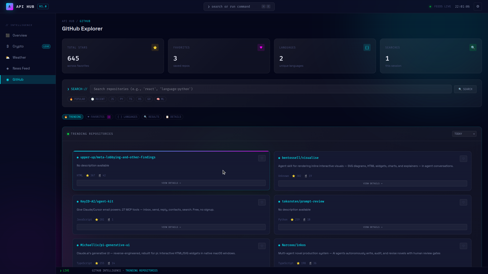

# API Hub — Dark Glass Terminal Dashboard


A multi-API intelligence dashboard built with Flask. Aggregates live data from news, weather, cryptocurrency, and GitHub APIs into a single dark-themed terminal-style interface.

---

## Screenshots

### Intelligence Dashboard


### Global News Center


### Weather Station


### Crypto Tracker


### GitHub Explorer


---

## Design System — Dark Glass Terminal

The UI is built on a custom design system called **Dark Glass Terminal (DGT)** — a dark, glassmorphic interface with a persistent shell chrome, monospace typography, and neon accents.

| Token | Value | Role |
|-------|-------|------|
| `--bg-void` | `#05071a` | Page background |
| `--bg-panel` | `#0f1535` | Cards and panels |
| `--cyan` | `#00f0ff` | Primary accent |
| `--green` | `#00ff41` | Positive / success |
| `--magenta` | `#ff00ff` | Secondary accent |
| `--amber` | `#ffb700` | Warning / highlight |
| `--red` | `#ff3355` | Negative / error |

Fonts: **Space Grotesk** (UI) and **Fira Code** (monospace)

Shell chrome includes: topbar with live clock, collapsible sidebar with API status indicators, live ticker bar, command palette, and a global toast notification system.

---

## Features

### Intelligence Dashboard
- 4 live metric cards: latest news count, temperature, BTC price, trending repo count
- SVG sparkline graphs per metric
- 2x2 panel grid with news, weather, crypto, and GitHub widgets
- Live ticker showing BTC price and current city weather
- Auto-refreshes every 5 minutes

### Global News Center
- Global trending news from 13 countries
- Local news via GPS auto-detection (Nominatim reverse geocoding)
- 7 categories: General, Business, Technology, Entertainment, Health, Science, Sports
- Real-time search with 500ms debounce
- Load More pagination

### Weather Station
- GPS auto-detection for current city
- Save unlimited cities to localStorage
- Current conditions: temperature, humidity, wind, pressure, feels like, hi/lo, sunrise/sunset
- 5-day forecast with daily summary cards

### Crypto Tracker
- Live prices for top 50 cryptocurrencies via CoinGecko (no API key required)
- Portfolio management with real-time profit/loss calculations
- Price alerts stored in localStorage (above/below target)
- Trending coins tab
- Auto-refreshes every 60 seconds

### GitHub Explorer
- Search any public repository
- Trending repos: daily, weekly, monthly
- Browse by programming language
- Save favorite repositories to localStorage
- Full repository details: stars, forks, issues, license, topics

---

## Quick Start

### 1. Clone and install
```bash
git clone https://github.com/b5119/flask-api-dashboard.git
cd flask-api-dashboard
python -m venv venv
source venv/bin/activate       # Windows: venv\Scripts\activate
pip install -r requirements.txt
```

### 2. Get free API keys

| API | Time | Required | Link |
|-----|------|----------|------|
| NewsAPI | 2 min | Yes | https://newsapi.org/register |
| OpenWeatherMap | 2 min | Yes | https://openweathermap.org/api |
| GitHub Token | 1 min | No | https://github.com/settings/tokens |
| CoinGecko | — | No | No key needed |

### 3. Create `.env` in the project root
```env
SECRET_KEY=change-this-to-a-random-string
NEWSAPI_KEY=your_newsapi_key_here
OPENWEATHER_API_KEY=your_openweathermap_key_here
GITHUB_TOKEN=optional_github_token
FLASK_ENV=development
```

### 4. Run
```bash
python run.py
```

Visit **http://localhost:5000**

---

## Project Structure
```
flask-api-dashboard/
├── app/
│   ├── __init__.py                  # Application factory
│   ├── api/                         # External API service wrappers
│   │   ├── news_api.py
│   │   ├── weather_api.py
│   │   ├── crypto_api.py
│   │   └── github_api.py
│   ├── routes/                      # Flask route controllers
│   │   ├── main.py                  # Dashboard + /health + /dashboard/data
│   │   ├── news.py
│   │   ├── weather.py
│   │   ├── crypto.py
│   │   └── github.py
│   ├── templates/
│   │   ├── base.html                # DGT shell: topbar, sidebar, ticker, Utils
│   │   ├── index.html               # Intelligence Dashboard
│   │   ├── news.html                # Global News Center
│   │   ├── weather.html             # Weather Station
│   │   ├── crypto.html              # Crypto Tracker
│   │   └── github.html              # GitHub Explorer
│   ├── static/
│   │   ├── css/
│   │   │   └── dark-glass-terminal.css   # DGT design system
│   │   └── img/                          # Screenshots
│   └── utils/
│       ├── logger.py                # Structured rotating file logger
│       └── rate_limit.py            # Flask-Limiter (200/day, 50/hour)
├── logs/
│   └── dashboard.log
├── config.py
├── run.py
├── requirements.txt
├── SETUP_GUIDE.md
├── IMPROVEMENTS.md
└── README.md
```

---

## Tech Stack

### Backend
| Package | Version | Purpose |
|---------|---------|---------|
| Flask | 3.0 | Web framework |
| Flask-Limiter | — | Rate limiting |
| Requests | 2.31 | HTTP client |
| Python-dotenv | 1.0 | Environment config |

### Frontend
| Library | Purpose |
|---------|---------|
| Dark Glass Terminal CSS | Custom design system |
| jQuery 3.7.1 | DOM manipulation and AJAX |
| Space Grotesk / Fira Code | Typography via Google Fonts |

### APIs
| API | Free Limit | Key Required |
|-----|-----------|--------------|
| NewsAPI | 100 req/day | Yes |
| OpenWeatherMap | 1,000 req/day | Yes |
| CoinGecko | Unlimited | No |
| GitHub | 60 req/hr (5K with token) | Optional |

---

## Data Persistence

All user data is stored in localStorage — no database or authentication required.

| Page | Keys |
|------|------|
| Weather | `weather_saved_cities`, `weather_default_city` |
| Crypto | `crypto_portfolio`, `crypto_alerts` |
| GitHub | `github_favorites`, `github_search_count` |

---

## Health Check
```bash
curl http://localhost:5000/health
```

The sidebar in the dashboard also shows live API status indicators for NewsAPI, Weather, CoinGecko, and GitHub.

---

## Roadmap

### Completed
- Dark Glass Terminal design system across all 5 pages
- Intelligence Dashboard with sparklines and live widgets
- Global and local news with GPS detection
- Weather with saved cities and 5-day forecast
- Crypto portfolio with real-time P/L and alerts
- GitHub explorer with favorites and full repo details
- Structured logging, rate limiting, health endpoint
- jQuery and Utils object loaded globally via base.html

### Planned
- Browser push notifications for price alerts
- Portfolio export to CSV
- WebSocket real-time price stream
- User authentication with cloud-sync preferences
- Crypto price history charts

---

## Troubleshooting

See [SETUP_GUIDE.md](SETUP_GUIDE.md) for detailed troubleshooting steps.

Common issues:
- **API key not found** — check `.env` exists in project root and restart Flask
- **Weather not loading** — new OpenWeatherMap keys take 10–15 min to activate
- **Location not detected** — allow browser location permission, or use manual search
- **GitHub stuck loading** — 60 req/hr limit reached without token; add `GITHUB_TOKEN` to `.env`

---

## Contributing

1. Fork the repository
2. Create a feature branch: `git checkout -b feature/your-feature`
3. Commit your changes: `git commit -m "Add: your feature"`
4. Push and open a Pull Request

Please follow PEP 8, add comments for complex logic, and test before submitting.

---

## Author

**Frank Bwalya**
- GitHub: [b5119](https://github.com/b5119)
- Email: bwalyafrank61@gmail.com

---

## Acknowledgements

- [NewsAPI](https://newsapi.org) — News data
- [OpenWeatherMap](https://openweathermap.org) — Weather data
- [CoinGecko](https://coingecko.com) — Cryptocurrency data
- [GitHub API](https://docs.github.com/en/rest) — Repository data
- [Nominatim](https://nominatim.org) — Reverse geocoding

---

Made with Flask and the Dark Glass Terminal design system · 2025 Frank Bwalya
